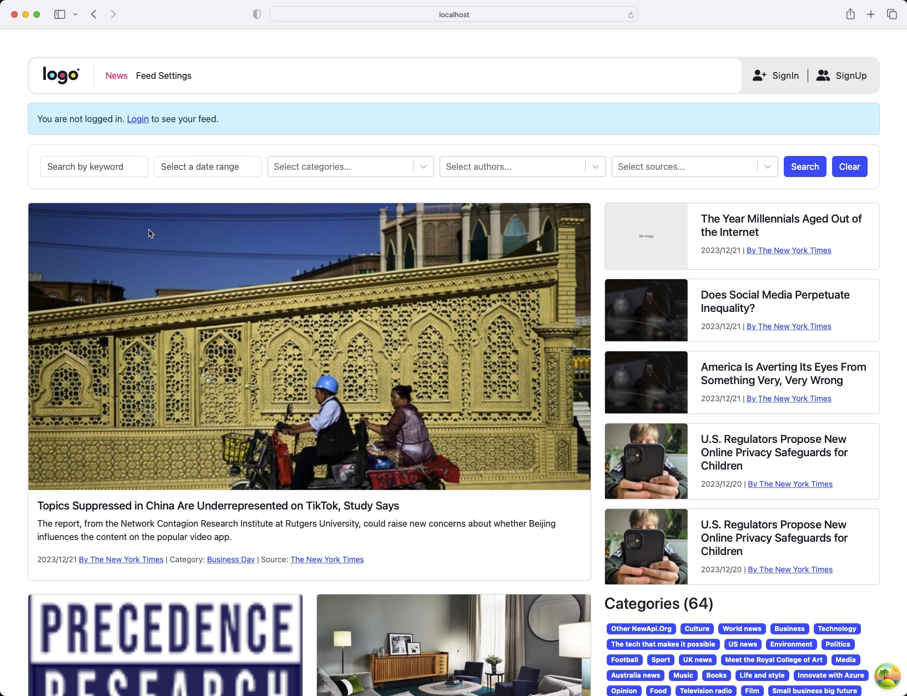

## News Site PHP + Laravel + ReactJS + TypeScript

News Aggregator web site: PHP + Laravel + ReactJS

**Frontend Tech:-** ReactJS, TypeScript, ReactQuery by TanStack https://tanstack.com/query/v3/

**Backend Tech:-** PHP, Laravel, MySQL

**News Feed From**
- [NewAPI.org - https://newsapi.org](https://newsapi.org)
- [The Guardian - https://www.theguardian.com](https://www.theguardian.com)
- [New York Time - https://nytimes.com](https://nytimes.com)

## Frontend Setup

Follow these commands to setup and run the frontend project.

### 1) `nvm use`

First run `nvm use` command set NodeJS version this project required.

### 2) `yarn`

### 3) `yarn start`

### 4) `yarn build`

### 5) `yarn fix:preBuild`

Needs to execute before all git add/commit to fix Linting, TS, and SCSS issue and formatting.
All below command will be executed when run `fix:preBuild`

- `yarn fix:style`
- `yarn fix:lint`
- `yarn fix:esLint`

### 6) Update the API endpoint domain

Update `const API_BASE_URL` under `src/api/endpoints.ts` (NOTE: As of now static. Needs to be in ENV)

## Project Setup

Follow all these steps to setup the backend

### Execute command in backend

1. `composer install`
2. `php artisan migrate`
3. `php artisan db:seed`
4. `php artisan passport:install`
5. `php artisan serve` will run API server on url `http://127.0.0.1:8000`

### Setup the API document and News Feed.

1. Import `API-document.postman_collection.json` into Postman (https://www.postman.com)
2. Setup variable `{{baseUrl}}` with backend URL `http://127.0.0.1:8000`
3. Setup variable `{{accessToken}}` and store signIn access_token to use it in protected APIs. Like preferences endpoint.
4. To insert news feed in DB. Execute the API in Postman collection `Sync Feed > Get Latest News Feed`. Read its documentation and params description carefully.
